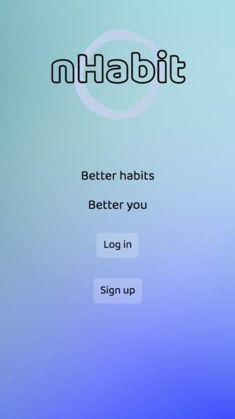
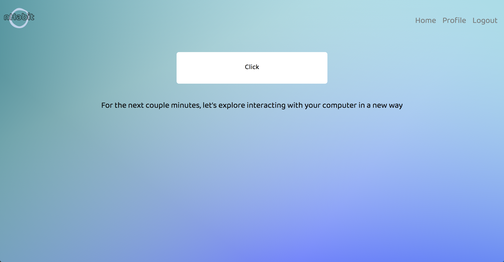

# nHabit

  

nHabit is a progressive web app for encouraging a healthier relationship with our devices! The app gamifies the everyday interactions we have with our devices, whether clicking, typing, or swiping, and creates an environment for these actions to be done more mindfully.

## Screenshots

  
  

## Getting started

This project was generated with [Angular CLI](https://github.com/angular/angular-cli) version 12.0.3.

## Development server

Run `ng serve` for a dev server. Navigate to `http://localhost:4200/`. The app will automatically reload if you change any of the source files.

## Code scaffolding

Run `ng generate component component-name` to generate a new component. You can also use `ng generate directive|pipe|service|class|guard|interface|enum|module`.

## Build

Run `ng build` to build the project. The build artifacts will be stored in the `dist/` directory.

## Running unit tests

Run `ng test` to execute the unit tests via [Karma](https://karma-runner.github.io).

## Running end-to-end tests

Run `ng e2e` to execute the end-to-end tests via a platform of your choice. To use this command, you need to first add a package that implements end-to-end testing capabilities.

**Recommended!**

- [nHabit backend](https://github.com/kipvla/nhabit-backend)

## Tech Stack

- [Angular](https://angular.io/)
